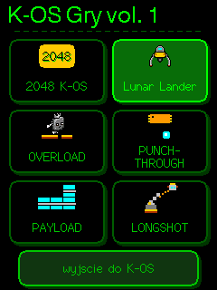
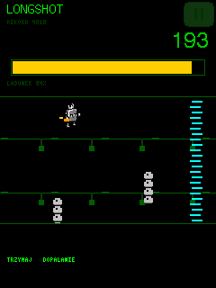
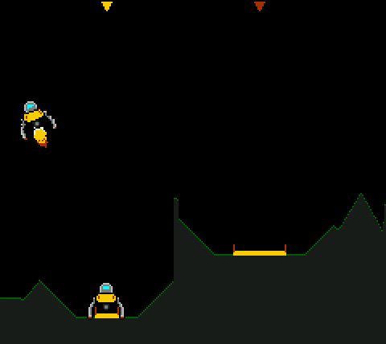
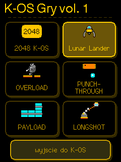
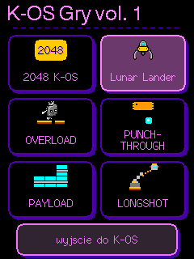
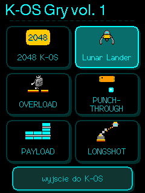
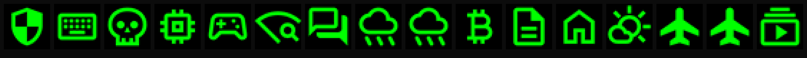

# K-OS — KORONA OS for CYD

K-OS to menu programów dla płytek ESP32 „Cheap Yellow Display” (CYD): programy trzymasz na karcie microSD, dotykasz — startuje, reset — wracasz do menu. Jest dla właścicieli CYD 2.4" i 2.8", którzy chcą mieć na jednej płytce radar samolotów, stację pogodową, gry, narzędzia WiFi/BLE i inne programy — i przełączać się między nimi bez kabla i bez kompilowania. Żeby go zainstalować, otwórz stronę instalacyjną w Chrome lub Edge na komputerze, podłącz płytkę kablem USB do danych i kliknij przycisk swojej płytki; programy dobierzesz potem ze sklepu KORONA na samej płytce.

K-OS is a program menu for ESP32 “Cheap Yellow Display” (CYD) boards: your apps live on a microSD card, you tap one and it runs, you press reset and you are back in the menu. It is for owners of 2.4" and 2.8" CYD boards who want an aircraft radar, a weather station, games, WiFi/BLE tools and more on one board — and to switch between them with no cable and no compiling. To install it, open the install page in Chrome or Edge on a computer, connect the board with a USB data cable and click the button for your board; after that you add apps from the KORONA store, right on the board.

## [Zainstaluj w przeglądarce / Install from your browser →](https://pixelpetrol.github.io/korona-programy/portal/)

Chrome lub Edge na komputerze · kabel USB do danych · karta microSD (FAT32)<br>
Chrome or Edge on a computer · a USB data cable · a microSD card (FAT32)

Lista programów z opisami i ocenami / App list with descriptions and ratings: **[portal/sklep.html](https://pixelpetrol.github.io/korona-programy/portal/sklep.html)**

## Którą mam płytkę? / Which board do I have?

| obraz / image | płytka / board | po czym poznać / how to tell | stan / status |
|---|---|---|---|
| **`cyd24`** | CYD 2.4"<br>ESP32-2432S024R | ekran 2.4", ILI9341, podświetlenie GPIO 27<br>2.4" screen, ILI9341, backlight on GPIO 27 | **sprawdzona** — autor ma tę płytkę<br>**tested** — the author owns this board |
| **`cyd28`** | CYD 2.8"<br>ESP32-2432S028R | ekran 2.8", **jedno** gniazdo USB, ILI9341<br>2.8" screen, **one** USB socket, ILI9341 | **sprawdzona przez zewnętrznego testera** na K-OS 0.4.3 i 0.7.1: ekran, karta, sklep, programy, WiFi; dotyk celny ze zmierzoną kalibracją, która od K-OS 0.7.4 jest domyślna (samego 0.7.4 tester jeszcze nie zgłosił)<br>**tested by an outside tester** on K-OS 0.4.3 and 0.7.1: screen, SD card, store, apps, WiFi; touch accurate with a measured calibration, the default since K-OS 0.7.4 (no report on 0.7.4 itself yet) |
| **`cyd28s`** | CYD 2.8" „2 USB”<br>ESP32-2432S028 | ekran 2.8", **dwa** gniazda USB, ST7789<br>2.8" screen, **two** USB sockets, ST7789 | **według telemetrii działa u użytkowników** (startuje i łączy się z WiFi), ale kolorów i dotyku nikt nam nie potwierdził — sami tej płytki nie mamy<br>**runs for users according to telemetry** (boots and connects to WiFi), but nobody has confirmed colours or touch to us — we do not own this board |

Na stronie instalacyjnej to przyciski „2.4"”, „2.8"” i „2.8" ST7789”. Masz 2.8" i nie wiesz, która to wersja? Policz gniazda USB: jedno — `cyd28`, dwa — najpewniej `cyd28s`. **Zły obraz niczego nie psuje na stałe:** czarny ekran po wgraniu to zwykle zła płytka (2.4" i 2.8" mają podświetlenie na innym pinie), więc po prostu wgraj obraz drugiej. Tryb programowania ESP32 siedzi w ROM-ie, więc płytkę zawsze da się wgrać od nowa (wyjątek: płytki z włączonym flash encryption lub secure boot). Na `cyd28s` obraz wychodzi w negatywie albo z zamienionym czerwonym i niebieskim? Napisz w [Issues](https://github.com/PixelPetrol/korona-programy/issues) — to jedna flaga do poprawienia.

On the install page these are the “2.4"”, “2.8"” and “2.8" ST7789” buttons. Got a 2.8" board and not sure which one? Count the USB sockets: one — `cyd28`, two — most likely `cyd28s`. **A wrong image does no permanent harm:** a black screen after flashing usually means the wrong board (2.4" and 2.8" drive the backlight from different pins), so just install the other image. The ESP32 bootloader mode lives in ROM, so the board can always be flashed again (except boards with flash encryption or secure boot enabled). On `cyd28s` the picture comes out inverted, or with red and blue swapped? Tell us in [Issues](https://github.com/PixelPetrol/korona-programy/issues) — it is a one-flag fix.

## Galeria / Gallery

Podglądy wyrenderowane na komputerze z kodu programów, nie zdjęcia płytki; drobne napisy mogą mieć inny krój niż na ekranie.<br>
Previews rendered on a computer from the programs' code, not photos of a board; small text may use a different typeface than on the screen.

<table>
  <tr>
    <td align="center" valign="top" width="33%">
      
      <br><b>K-OS GAME VOL1</b> — menu tomu gier, motyw zielony
      <br><sub>the games volume menu, green theme</sub>
    </td>
    <td align="center" valign="top" width="33%">
      
      <br><b>Longshot</b> — Chip-K w locie po wystrzale z prasy
      <br><sub>Chip-K in flight after the launch from the press</sub>
    </td>
    <td align="center" valign="top" width="33%">
      
      <br><b>Lunar Lander</b> — poziom 9: teren z generatora gry, lądownik w locie i drugi na lądowisku (sama arena)
      <br><sub>level 9: terrain from the game's generator, a lander in flight and another on a pad (arena only)</sub>
    </td>
  </tr>
  <tr>
    <td align="center" valign="top">
      
      <br>motyw złoty<br><sub>gold theme</sub>
    </td>
    <td align="center" valign="top">
      
      <br>motyw fioletowy<br><sub>purple theme</sub>
    </td>
    <td align="center" valign="top">
      
      <br>motyw cyjan<br><sub>cyan theme</sub>
    </td>
  </tr>
</table>

K-OS ma cztery motywy (zielony, złoty, fioletowy, cyjan); gry biorą motyw i język z ustawień K-OS.<br>
K-OS has four themes (green, gold, purple, cyan); the games take their theme and language from the K-OS settings.



Ikony programów ze sklepu, kolejno: Bruce, ESP32-DIV, GAME VOL1, Marauder, Handset, Meteo (×2), NerdMiner, Office, openHASP, Pogoda, SkyCYD (×2) — maski 32×32, które K-OS maluje kolorem motywu (tu zielonym), powiększone 3×.<br>
Store app icons, in order: Bruce, ESP32-DIV, GAME VOL1, Marauder, Handset, Meteo (×2), NerdMiner, Office, openHASP, Pogoda, SkyCYD (×2) — 32×32 masks that K-OS paints in the theme colour (green here), scaled 3×.

## Co jest w sklepie / What's in the store

Programy autorskie (Piotr Korona) i porty cudzych projektów, przerobione tak, żeby reset wracał do menu. Stan na 25.09.2026 — aktualna lista z pełnymi opisami: [sklep.html](https://pixelpetrol.github.io/korona-programy/portal/sklep.html). Opisy w sklepie mówią wprost, czego nikt jeszcze nie sprawdził na danej płytce („NIESPRAWDZONE”).<br>
Piotr Korona's own apps plus ports of other people's projects, reworked so that reset returns to the menu. As of 25 Sep 2026 — the current list with full descriptions: [sklep.html](https://pixelpetrol.github.io/korona-programy/portal/sklep.html). Store descriptions say plainly what nobody has tested on a given board yet (“UNTESTED”).

| program | co robi / what it does | autor / author | płytki / boards |
|---|---|---|---|
| **SkyCYD** (pion, poziom) | radar ADS-B: samoloty wokół domu, dane z adsb.lol przez internet; tylko po polsku<br>ADS-B radar: planes around your home, data from adsb.lol over the internet; Polish only | Piotr Korona | cyd24 cyd28 cyd28s |
| **Meteo K-OS** (pion, poziom) | pogoda z Open-Meteo i radar opadów IMGW<br>weather from Open-Meteo and the IMGW rain radar | Piotr Korona | cyd24 cyd28 cyd28s |
| **K-OS Office** | notatnik, kalkulator, kalendarz, pliki, kody QR, kursy walut<br>notes, calculator, calendar, files, QR codes, exchange rates | Piotr Korona | cyd24 cyd28 cyd28s |
| **K-OS Handset** | komunikator MeshCore po Bluetooth, do własnego węzła<br>MeshCore messenger over Bluetooth, for your own node | Piotr Korona | cyd24 cyd28 cyd28s |
| **K-OS GAME VOL1** | tom gier: 2048, Lunar Lander i inne<br>a games volume: 2048, Lunar Lander and more | Piotr Korona | cyd24 cyd28 cyd28s |
| **Ropeburn Mini** | skakanka na rytm — skaczesz Ty<br>jump rope to the beat — you do the jumping | Piotr Korona | cyd24 cyd28 cyd28s |
| **DOOM (BETA)** | silnik DOOM jako program K-OS; dane gry (Freedoom albo własna kopia) przygotowujesz sam — [źródło i instrukcja](https://github.com/PixelPetrol/cyd-doom-kos)<br>DOOM engine as a K-OS program; you bring the game data (Freedoom or your own copy) — [source and instructions](https://github.com/PixelPetrol/cyd-doom-kos) | id Software, doomhack (GBADoom), HenrysCat (cyd-doom) / port: Piotr Korona | cyd24 cyd28 cyd28s |
| **Bruce (LITE)** | pentest toolkit WiFi / BLE / IR / RF<br>WiFi / BLE / IR / RF pentest toolkit | pr3y | cyd24 cyd28 cyd28s |
| **Marauder** | audyt WiFi / BLE<br>WiFi / BLE auditing | justcallmekoko / Fr4nkFletcher | cyd24 cyd28 cyd28s |
| **ESP32-DIV** | multitool WiFi / BLE / RF<br>WiFi / BLE / RF multitool | cifertech / Wontfallo (HaleHound-CYD) | cyd24 cyd28 cyd28s |
| **NerdMiner v2** | kopacz-loteria BTC, kurs i bloki<br>BTC lottery miner, price and blocks | BitMaker-hub | cyd24 |
| **openHASP** | panel dotykowy Home Assistant<br>Home Assistant touch panel | Francis Van Roie (fvanroie) | cyd24 |
| **Pogoda** | prognoza pogody z Open-Meteo, bez klucza<br>weather forecast from Open-Meteo, no key | nicholaswilde | cyd24 |

Programy zewnętrzne mają swoich autorów i własne licencje. Narzędzi WiFi/BLE używaj tylko wobec własnych sieci i urządzeń. Własny program może zgłosić każdy — niżej, w części dla autorów.<br>
Third-party apps have their own authors and licences. Use the WiFi/BLE tools only on your own networks and devices. Anyone can submit their own app — see the section for app authors below.

## Dobrze wiedzieć / Good to know

- **Najpierw kopia zapasowa.** Wgranie K-OS nadpisuje program, który jest dziś na płytce. Strona instalacyjna ma przycisk kopii całego flasha (ta droga przez przeglądarkę nie była jeszcze sprawdzona na sprzęcie) i gotową komendę esptool.<br>
  **Back up first.** Installing K-OS overwrites the program the board runs today. The install page has a whole-flash backup button (that browser route is not yet tested on hardware) and a ready esptool command.
- **Programy ze sklepu.** Karta microSD w FAT32 (karty powyżej 32 GB trzeba sformatować na FAT32 osobno), potem na płytce: ustawienia → sieć WiFi → skanuj i połącz, a w menu głównym „sklep KORONA”. Programy lecą z GitHuba prosto na kartę. Z telefonu albo komputera w tej samej sieci kartą zarządza strona WWW płytki: `http://korona.local/` (albo adres IP płytki).<br>
  **Getting apps.** A FAT32 microSD card (cards over 32 GB need a separate FAT32 format), then on the board: settings → WiFi → scan and connect, and “KORONA store” in the main menu. Apps download from GitHub straight to the card. From a phone or computer on the same network, the board's web page manages the card: `http://korona.local/` (or the board's IP address).
- **Reset wraca do menu — w programach ze sklepu KORONA.** Obcy `.bin` wrzucony na kartę nie zna tej umowy i płytka będzie do niego wracać po każdym resecie. Wyjście: podłącz USB, trzymaj `BOOT` przy podłączaniu i wgraj K-OS ze strony jeszcze raz. Nic nie ginie na stałe.<br>
  **Reset returns to the menu — for KORONA store apps.** A foreign `.bin` dropped on the card does not know that contract, and the board will keep returning to it after every reset. Way out: connect USB, hold `BOOT` while plugging in, and install K-OS from the page again. Nothing is lost for good.
- **Co K-OS wysyła.** Raz na dobę: losowy numer instalacji (nie adres MAC), wersję K-OS, model płytki i to, ile razy otwarto każdy program. Bez MAC, IP, nazwy sieci i godzin uruchomień. Domyślnie włączone; wyłączasz w ustawienia → system → statystyki użycia.<br>
  **What K-OS sends.** Once a day: a random install number (not the MAC address), the K-OS version, the board model and how many times each app was opened. No MAC, no IP, no network name, no clock times. On by default; turn it off under settings → system → usage statistics.
- **Kłopot?** Strona instalacyjna ma rozdział „Gdy coś nie idzie”; usterki zgłaszaj w [Issues](https://github.com/PixelPetrol/korona-programy/issues).<br>
  **Trouble?** The install page has a “When something goes wrong” section; report bugs in [Issues](https://github.com/PixelPetrol/korona-programy/issues).

---

## Dla autorów programów / For app authors

*English:* the author guide is bilingual — [programy.html](https://pixelpetrol.github.io/korona-programy/portal/programy.html) (Model B, board flags, memory, testing, submitting), and [zglos.html](https://pixelpetrol.github.io/korona-programy/portal/zglos.html) checks your `.bin` in the browser and opens a ready-made submission. The rest of this section is the maintainer's notes, in Polish.

Każdy program to pełny obraz aplikacji ESP32 (magic `0xE9`), mieszczący się w slocie `ota_0` K-OS (2 555 904 B). Program MUSI na początku `setup()` kasować partycję `otadata` („Model B”), inaczej po resecie nie wróci do K-OS. Szczegóły: [portal/programy.html](https://pixelpetrol.github.io/korona-programy/portal/programy.html).

### Układ repozytorium

```
plytki.json                       spis płytek (id, nazwa) - kafelek „inne płytki” w K-OS i portal/sklep.html
katalog-<plytka>.json             katalog v3, jeden na płytkę (cyd24, cyd28, cyd28s) - K-OS >= 0.4.7 i portal/sklep.html
katalog.json                      stary wspólny katalog v2 - tylko starsze K-OS i strona WWW płytki (niżej)
bin/cyd24/*.bin                   CYD 2.4"  (ESP32-2432S024R) - programy sklepu (META w tools/katalog.py)
bin/cyd28/*.bin                   CYD 2.8"  (ESP32-2432S028R)
bin/cyd28s/*.bin                  CYD 2.8" ST7789 (ESP32-2432S028 „2 USB”)
bin/<plytka>/<nazwa>.ico          ikona programu (np. bin/cyd24/office.ico): maska alfa 4-bit 32x32 = 512 B
bin/<plytka>/uzytkownicy/*.bin    programy użytkowników + <id>.meta.json obok
info/<plytka>/<plik>.<jezyk>.txt  długie opisy (pl, en), np. info/cyd24/office.bin.en.txt
zgloszenia/<id>/                  skrzynka na nowe zgłoszenia (PR); po przyjęciu automat ją opróżnia
tools/katalog.py                  robi katalogi v3, plytki.json, katalog.json i info/ z bin/ (tabela META + *.meta.json)
tools/ikony.py                    ikony .ico z rysunków Material Symbols + podgląd art/podglad-ikony.png
tools/sprawdz_bin.py              czy .bin nadaje się do slotu ota_0 (czysty/scalony, rozmiar, app_desc)
tools/sprawdz_zgloszenie.py       walidator zgłoszenia (meta.json + .bin)
tools/przyjmij_zgloszenia.py      przenosi poprawne zgłoszenia do bin/<plytka>/uzytkownicy/
tools/sprawdz_zgodnosc_js.py      czy portal/zglos.js nie rozjechał się z regułami z tools/
tools/wydaj.sh                    lista kontrolna wydania K-OS: sprawdza i buduje, niczego nie publikuje
portal/                           strona instalacyjna (GitHub Pages) z obrazami K-OS, sklep.html, programy.html,
                                  zglos.html (sprawdzenie .bin w przeglądarce); jak to wypuścić: portal/README.md
art/                              podgląd ikon, obrazki tego README (art/galeria/), źródła SVG ikon (art/icons/)
.github/workflows/zgloszenie.yml  PR ze zgłoszeniem -> walidacja + komentarz
.github/workflows/przyjmij.yml    merge do main -> przeniesienie do bin/ + katalogi i info/ + commit bota
```

### Katalogi

- **`katalog-<plytka>.json` (v3)** — jeden plik na płytkę; czyta go K-OS ≥ 0.4.7 i `portal/sklep.html`. Krótki opis jest w nim dwujęzyczny (`"opis": {"pl": …, "en": …}`), a długi leży osobno w `info/<plytka>/<plik>.<jezyk>.txt` (ASCII, najwyżej 2500 znaków — dłuższy generator utnie) i K-OS pobiera go dopiero przy otwarciu karty programu. Pole `ikona` wskazuje plik `.ico` obok binarki (np. `bin/cyd24/office.ico`); gdy ikony nie ma, K-OS rysuje kafelek z inicjałami.
- **`plytki.json`** — spis płytek do kafelka „inne płytki”. K-OS na płytce X pokazuje domyślnie programy dla X; przez „inne płytki” można pobrać program dla innej płytki (np. przed przeniesieniem karty).
- **`katalog.json` (v2)** — zostaje tylko dla starszych K-OS (≤ 0.4.6), dla strony WWW płytki i jako droga awaryjna nowszego K-OS, gdy katalog v3 odpowie 404. Ma same pola minimalne: `plik rozmiar sha256 nazwa opis wersja kategoria autor` (`opis` to zwykły napis). Sufit to **26 000 B**: stary K-OS pobiera ten plik w całości do RAM, więc powyżej sufitu `tools/katalog.py` kończy się błędem i nie zapisuje niczego (ostrzeżenie od 20 000 B).
- Wszystkie te pliki robi `tools/katalog.py` — ręcznie się ich nie poprawia.

### Dodanie programu sklepu (autorskie / zewnętrzne)

1. Wrzuć `.bin` do `bin/<plytka>/` — osobna binarka na każdą płytkę (`cyd24`, `cyd28`, `cyd28s`).
2. Dopisz wpis w `META` w `tools/katalog.py`: `m(nazwa, opis, wersja, kategoria, autor, info="", opis_en="", info_en="")`. Kluczem jest nazwa pliku (wpis wspólny dla płytek) albo para `("<plytka>", "<plik>")`, która ma pierwszeństwo. Plik bez wpisu nie trafia do katalogu.
3. Ikona: dopisz program do tabeli `IKONY` w `tools/ikony.py` i uruchom `python3 tools/ikony.py` (rysunki Material Symbols, kopie SVG w `art/icons/`; potrzebuje PIL i `qlmanage` z macOS).
4. `python3 tools/katalog.py` — zapisuje katalogi v3, `plytki.json`, `katalog.json` i `info/`, wypisuje rozmiary i zapas v2.
5. `git add -A && git commit && git push`.

Sprawdzenie bez zapisu: `python3 tools/katalog.py --sprawdz` — nic nie zapisuje, mierzy v2 i porównuje wszystkie pliki z dyskiem. Kod wyjścia: 0 = w porządku, 1 = `katalog.json` (v2) ponad sufitem, 3 = pliki na dysku są nieaktualne (ktoś zmienił `bin/` albo `META` i nie przegenerował katalogów).

### Programy użytkowników (kategoria `uzytkownicy`)

Każdy może zgłosić swój program. Najkrótsza droga: [portal/zglos.html](https://pixelpetrol.github.io/korona-programy/portal/zglos.html) — sprawdza `.bin` w przeglądarce (te same reguły co `tools/sprawdz_bin.py`, plik nigdzie się nie wysyła), składa `meta.json` i otwiera gotowe zgłoszenie na GitHubie. Ta sama droga ręcznie, przez PR:

1. Przygotuj program według [programy.html](https://pixelpetrol.github.io/korona-programy/portal/programy.html) (Model B, flagi płytki, rozmiar ≤ 2 555 904 B, czysty obraz aplikacji). Przetestuj na płytce: uruchom pod K-OS, naciśnij RST — musi wrócić menu.
2. Zrób fork i dodaj katalog `zgloszenia/<id>/` z dwoma plikami: `<id>.bin` i `meta.json` (szablon i opis pól: [`zgloszenia/README.md`](zgloszenia/README.md)). `<id>`: 2–32 znaki, małe litery, cyfry, `-`, `_`; to nazwa pliku w sklepie i klucz ustawień na karcie — po publikacji się nie zmienia.
3. Sprawdź lokalnie: `python3 tools/sprawdz_zgloszenie.py zgloszenia/<id>` (albo w przeglądarce na `portal/zglos.html`).
4. Otwórz Pull Request. Action `zgloszenie` sprawdza zgłoszenie i wkleja raport (rozmiar, sha256, app_desc, błędy). Czerwony check = popraw i wypchnij jeszcze raz.
5. Przeglądający (Piotr) robi to, czego automat nie umie: wgrywa `.bin` na kartę, uruchamia, naciska RST. Jeśli menu wraca, a licencja i autorstwo się zgadzają — merge.
6. Po merge Action `przyjmij` przenosi `.bin` do `bin/<plytka>/uzytkownicy/<id>.bin`, zapisuje obok `<id>.meta.json`, uruchamia `tools/katalog.py` i commituje `bin/`, katalogi (v3, `plytki.json`, `katalog.json`) i `info/` jako `github-actions[bot]`. Program pojawia się w sklepie kilka minut po tym, jak na GitHubie są nowe katalogi (cache raw.githubusercontent.com).

Aktualizacja: ten sam `<id>`, wyższa `wersja`, znowu PR. Zgłoszenie może być scalonym obrazem flasha (bootloader + tablica + aplikacja) — automat wycina z niego aplikację, ale lepiej wysyłać czysty `firmware.bin` / `*.ino.bin`.

Reguły: `autor` to autor programu (przy porcie — oryginalny autor, zgłaszający w polu `zglaszajacy`); GPL wymaga `zrodlo`; `model_b: true` to oświadczenie autora. `nazwa`, `opis`, `info` i `autor` piszemy w ASCII — czcionka K-OS nie ma polskich znaków. Programy, które po RST nie wracają do menu, nie będą przyjęte — płytkę odzyskuje się wtedy tylko po USB.

Dla przeglądającego: PR z forka może zmieniać też `tools/` i `.github/` — Action ostrzega o plikach poza `zgloszenia/`; takich PR nie scalać bez przeczytania różnicy. Po każdym przyjętym zgłoszeniu: `git pull` i `python3 tools/katalog.py --sprawdz` — kod 0 znaczy, że katalogi na GitHubie zgadzają się z `bin/`. Kod 3: `python3 tools/katalog.py`, commit i push; bez aktualnych katalogów v3 programu nie pokażą K-OS ≥ 0.4.7 ani `portal/sklep.html`.

### Jak K-OS traktuje kategorie

Pole `kategoria`: `autorskie`, `zewnetrzne`, `uzytkownicy`. K-OS ≥ 0.3.7 pokazuje trzy zakładki; K-OS ≤ 0.3.6 zna tylko dwie pierwsze i wszystko, co nie jest `autorskie`, pokazuje w „zewnętrzne” (`net.cpp`, `progInCat`). „Użytkownicy” to programy zgłoszone przez użytkowników, sprawdzone tylko formalnie (rozmiar, format, reset → menu); za treść odpowiada autor.

---

K-OS — KORONA OS for CYD · Piotr Korona · instalator w przeglądarce / browser installer: [ESP Web Tools](https://esphome.github.io/esp-web-tools/) (ESPHome)
